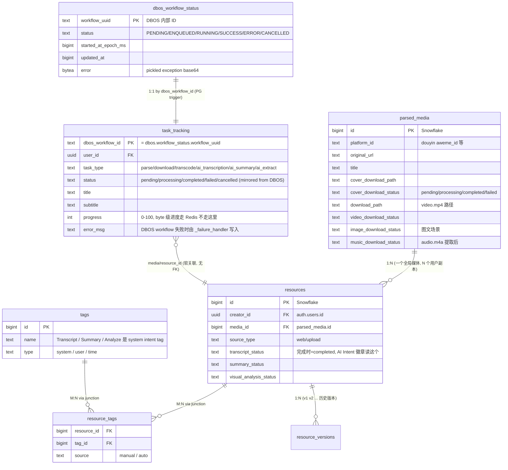
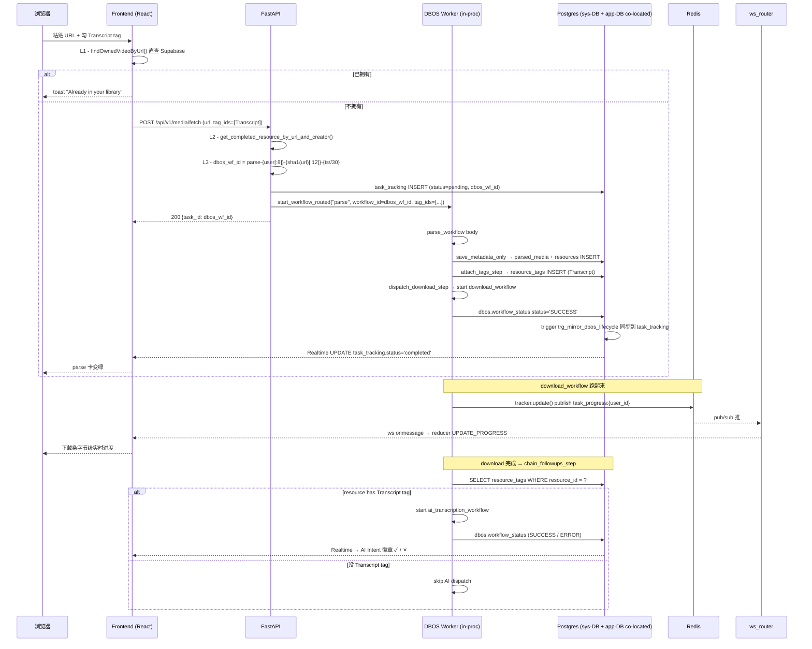

# D9 — 统一 Task Model 架构

> 任务系统在 D7 (Celery → DBOS port) + D8 (schema rename + trigger
> sync) + D9 (4 层 dedup + tag-driven AI + direct PG) 之后的最终形态。
> 本文是 D9 的封盘 doc，用来回答 "task 数据从哪来、谁是 source of
> truth、状态怎么传到前端" 这类问题，避免下次回头重新摸鱼。

## 一、四张表的角色 + ER 关系



## 二、数据流：用户点 "解析" → 看到完成卡



## 三、关键设计决策（4 个，每个都解决一个具体痛点）

### 1. task_tracking 是 dbos.workflow_status 的 sidecar

| 角色 | dbos.workflow_status | task_tracking |
|---|---|---|
| 谁拥有 | DBOS framework | 应用层 |
| Realtime 公开 | ❌ 不在 publication | ✅ 在 publication |
| 字段 | 标准 DBOS status + error | 业务字段 (title/subtitle/progress/media_id) |
| 同步方向 | DBOS 写 status → trigger 镜像 → task_tracking | 应用直接写业务字段 |
| 故障域 | DBOS workflow 生命周期 | 用户视图 / Realtime |

PG trigger `trg_mirror_dbos_lifecycle` 自动把 DBOS lifecycle (status / error / started_at) 镜像到 task_tracking，应用层不用手动同步。

### 2. dedup 4 层 (defense in depth)

| 层 | 在哪 | 命中场景 | 命中率 |
|---|---|---|---|
| L1 | 前端 useParser.handleSingleParse | 用户重复粘贴同一 URL | ~80% |
| L2 | API handle_media_fetch_dispatch 入口 | 非浏览器调用 (Shortcuts/扩展/API) 漏 L1 | 漏 L1 的兜底 |
| L3 | dbos_wf_id 30s bucket 幂等 | 双击 / 重试风暴 | 漏 L1+L2 的兜底 |
| L4 | download_workflow check_global_cache_step | 别人下过这个全局内容, 当前用户首次解析 | 节省带宽 + 复用文件 |

每一层独立: 前面漏一层下一层兜得住. 更详细见各层代码注释.

### 3. AI 触发: tag-driven 不是 setting-driven

旧模型 (已删): user_settings.ai_settings.{auto_transcribe,auto_summarize}
新模型: 每个 resource 上的 system intent tag

| Tag (name) | name_zh | 触发的 workflow |
|---|---|---|
| Transcript | 转录 | ai_transcription_workflow |
| Summary | 总结 | ai_summary_workflow (隐含 Transcript: summary 需要 transcript 文本) |
| Analyze | 分析 | analyze_l1_workflow (cover L1) |

触发点 2 个:
- **自动 chain**: download_workflow 完成 → chain_followups_step → maybe_chain_ai_pipeline 读 resource 的 tag, 命中 dispatch
- **手动 trigger**: MediaCard 上 Transcript / Summary / Analyze 按钮 → 直接 POST /api/v1/ai/{transcribe,summarize,analyze}/resource/{id}, 后端 pre-create task_tracking + start_workflow_routed

### 4. DBOS 直连 PG 绕开 supavisor

DBOS 必须 LISTEN/NOTIFY (queue 调度依赖) → 不能走 transaction-mode pooler. supavisor session 模式 pool_size=5 又会被 dev reload 撑爆 → 所以 DBOS sys-DB 直连 NAS PG 5432 (host: 55434, 我们在 docker-compose 加的端口暴露).

应用层其他 DB 访问 (PostgREST / Supabase JS) 继续走 supavisor 享受池化红利, 互不干扰.

## 四、故障兜底 (D9 最后一周大量精力解决的)

| 风险 | 机制 |
|---|---|
| DBOS workflow 抛异常 → 拖累 FastAPI 进程 | 每个 workflow 顶层 try/except + record_workflow_failure (写 task_tracking.failed) |
| uvicorn --reload + DBOS shutdown 卡死 | shutdown_dbos() 加 5s 超时 + daemon 线程 |
| dev backend hang 用户无感 | scripts/dev-backend.sh watchdog: 30s probe /health, 3 次失败 → kill -9 + restart |
| prod 容器 unhealthy 不会自启 | docker-compose 加 autoheal sidecar (willfarrell/autoheal) + mediahub 加 autoheal=true label |
| supavisor session pool 撑爆 | DBOS pool_size 20→5 + pool_pre_ping + 直连 PG 绕过 supavisor |

## 五、未实施 (Roadmap)

- **D10**: Gateway/Worker 进程分离. 现在 FastAPI + DBOS 同进程, workflow 异常仍可影响 HTTP. 拆开后彻底隔离.
- **D11**: @DBOS.scheduled 定时任务. 必须 D10 后做, 否则 cron 跟 HTTP 抢资源放大问题.
- **L1 兜底**: 前端 attach AI intent tag 后, 自动 dispatch 该 workflow (现在只在 parse 时勾 tag 才触发, 之后改 tag 不会重新跑).
- **音频写后验证 + event-driven transcript dispatch**: 删掉 wait_for_audio_step 轮询, 改 maybe_chain_ai_pipeline 入口判 music_download_status='completed' 才 dispatch.

## 六、表速查

```
public.task_tracking          PK: dbos_workflow_id (text, = DBOS uuid)
public.parsed_media           PK: id (Snowflake bigint)
public.resources              PK: id (Snowflake bigint), creator_id+media_id 唯一
public.tags                   PK: id (Snowflake bigint), system tags 内置 Transcript/Summary/Analyze
public.resource_tags          junction (resource_id, tag_id)
public.resource_versions      PK: id, resource_id+version_number 唯一

dbos.workflow_status          PK: workflow_uuid (text)
dbos.workflow_inputs          PK: workflow_uuid
dbos.operation_outputs        per-step 输出快照
dbos.workflow_events          send/recv 事件
```

## 七、相关代码地图

| 主题 | 文件 |
|---|---|
| Schema 迁移 | supabase/migrations/180_task_tracking_rename.sql, 181/182/183 |
| PG trigger | mirror_dbos_lifecycle_to_tracking() in 180 |
| DBOS 单例 + 直连 PG | backend/app/services/dbos_orchestrator.py |
| Workflow 顶层兜底 | backend/app/workflows/_failure_handler.py |
| Parse 链 | backend/app/workflows/parse.py (含 attach_tags_step) |
| Download 链 | backend/app/workflows/download.py (含 cache_hit copy resource_version) |
| AI 工作流 | backend/app/workflows/ai_transcription.py, ai_summary.py, analyze_l1.py |
| Tag-driven dispatch | backend/app/tasks/download_helpers.py::maybe_chain_ai_pipeline |
| 4 层 dedup L1 | frontend/services/dataService.ts::findOwnedVideoByUrl |
| 4 层 dedup L2 | backend/app/repositories/resources_repository.py::get_completed_resource_by_url_and_creator |
| 4 层 dedup L3 | backend/app/api/media_fetch_helpers.py::handle_media_fetch_dispatch |
| 4 层 dedup L4 | backend/app/workflows/download.py::check_global_cache_step + cache_hit branch |
| 进度推送 | backend/app/tasks/download_progress.py + backend/app/api/ws_router.py |
| Frontend Realtime + WS | frontend/contexts/TaskManagerContext.tsx |
| Dev watchdog | scripts/dev-backend.sh |
| Prod 自启 | /Volumes/docker/mediahub/docker/docker-compose.yml (autoheal sidecar) |
